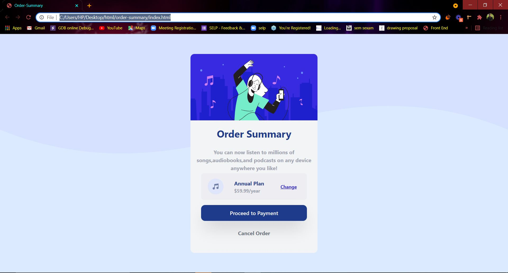

# Gradie Sign up page

This is a Challenge accepted from [frontendmento.io](https://www.frontendmentor.io/challenges/order-summary-component-QlPmajDUj). It is an order summary component designed using Tailwind css.

[**click here to view the component**](https://harishkumaaran.github.io/order-summary-component/)
&nbsp;

# screenshots
&nbsp;

### Mobile version

&nbsp;

### Desktop version

&nbsp;

&nbsp;

# Technology Stack
- HTML
- CSS
- Tailwind CSS

&nbsp;

# Credits
- This Order summary component challenge is done as a part of my Front end curriculum at Aekam Labs, Coimbatore.

